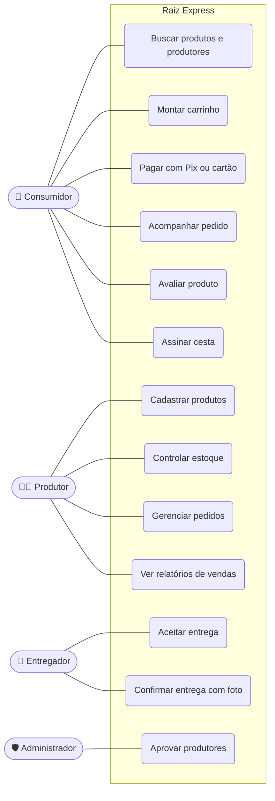

# Diagrama de Caso de Uso: Raiz Express

```mermaid
flowchart LR
    C([👤 Consumidor])
    P([🧑‍🌾 Produtor])
    E([🚚 Entregador])
    A([🛡️ Administrador])

    subgraph Sistema["Raiz Express"]
        UC1(Buscar produtos e produtores)
        UC2(Montar carrinho)
        UC3(Pagar com Pix ou cartão)
        UC4(Acompanhar pedido)
        UC5(Avaliar produto)
        UC6(Assinar cesta)
        UC7(Cadastrar produtos)
        UC8(Controlar estoque)
        UC9(Gerenciar pedidos)
        UC10(Ver relatórios de vendas)
        UC11(Aceitar entrega)
        UC12(Confirmar entrega com foto)
        UC13(Aprovar produtores)
    end

    C --- UC1 & UC2 & UC3 & UC4 & UC5 & UC6
    P --- UC7 & UC8 & UC9 & UC10
    E --- UC11 & UC12
    A --- UC13
```

